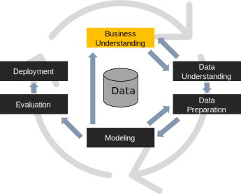
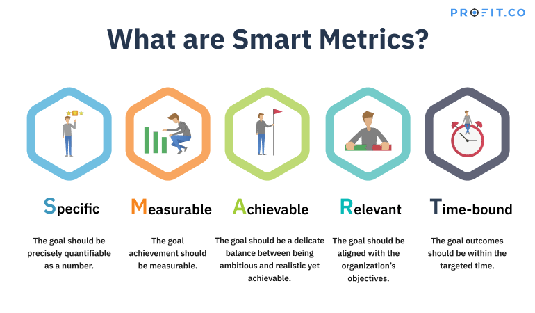

#

# Business Understanding

(*Perhaps the most important/hard phase of any data mining project* [@shearer2000crisp])

The **business understanding** phase focuses on

1. determine the *business objectives*
2. assessing the *context of the analysis*
3. determining and *translating objectives into data mining goals*
4. producing the *project plan*

This is essential also to understand which data should later be analyzed and how

#  Business Understanding: Brown Spot {background-color="#121011"}



#  Business Understanding: Personal Gazetteer {background-color="#121011"}



# End of the case studies

# Determine the Business Objectives

**Understanding a client's true goal** is critical to uncovering the important factors involved in the project

- Data analysts must uncover the primary business objective as well as the related questions the business would like to address
- Ensure that the project *does not produce the right answers to the wrong questions*
- Beware of *setting unattainable goals*
- Make sure that each *success criterion relates to at least one of the specified business objectives*

> The business goal could be to retain current customers by predicting when they are prone to move to a competitor
>
> - "How does the primary channel (e.g., ATM, branch visit, Internet) of a bank customer affect whether they stay or go?"
> - "Will lower ATM fees significantly reduce the number of high-value customers who leave?"

# Assess the Situation

**Outline the available resources** to accomplish the data mining project, from personnel to software

- *Discover what data is available* to meet the primary business goal
  - Do you have data that's relevant to the question?
    - Do you have measures of the target and features that are related to the target?
    - Do you have an accurate measure of your model target and the features of interest?
  - An existing system might not have the data it needs to address a problem and achieve a project goal
    - Find external data sources or update your systems to collect new data

> To address the business question, a minimum number of customers over age 50 is necessary

- List the *project risks and potential solutions* to those risks
- List the *assumptions* made in the project
- Create a *glossary of business and data mining terms*
  - This is essential in interdisciplinary teams!
- Construct a *cost-benefit analysis* for the project

#

Things are more complex in a company (*this is the added value of DTM!*)

*Determine the Organizational Structure*

1. Identify key individuals in the organization (also to provide domain expertise)
1. Identify business units that will be affected by the data mining project

*Describe Problem Area*

1. Identify the problem area, such as marketing, customer care, or business development.
1. Describe the problem in general terms
1. Clarify the prerequisites of the project
    - What are the motivations behind the project?
    - Does the business already use data mining?
1. Check on the status of the data mining project within the business group
    - Has the effort been approved, or does data mining need to be "advertised" as a key technology for the business group?
1. If necessary, prepare informational presentations on data mining for your organization

*Describe Current Solution*

1. Describe any solutions currently used to address the business problem
1. Describe the advantages and disadvantages of the current solution

# Determine the Data Mining Goals

Formulate **project objectives in business terms**

Ask and refine sharp questions that are relevant, specific, and unambiguous.

- Data science is a process that *uses numbers to answer such questions*
- You typically use data science or machine learning to answer *five types of questions*
    1. How much or how many? (regression)
    1. Which category? (classification)
    1. Which group? (clustering)
    1. Is this unusual? (anomaly detection)
    1. Which option should be taken? (recommendation)

#

:::: {.columns}
::: {.column width="50%"}

The metrics must be **SMART**:

- *S*pecific
- *M*easurable
- *A*chievable
- *R*elevant
- *T*ime-bound

:::
::: {.column width="50%"}

:::
::::

If the business goal cannot be effectively translated into a data mining goal, *it may be wise to consider redefining the problem*

> Success may be measured by reducing lost customers by 10% or by achieving a better understanding of the customer base
>
> Success should also be defined in these terms such as achieving a certain level of predictive accuracy

#  Case study: Sport KPIs {background-color="#121011"}



# End of the case study: Sport KPIs

# Produce a Project Plan

**Describe the intended plan for achieving the goals**, including:

- outlining specific steps and a proposed timeline
- an assessment of potential risks
- and an initial assessment of the tools and techniques needed to support the project

Generally accepted industry timeline standards are [@shearer2000crisp]:

- 50 to 70 percent of the time and effort in a data mining project involves the *Data Preparation Phase*;
- 20 to 30 percent involves the *Data Understanding Phase*;
- only 10 to 20 percent is spent in each of the *Modeling, Evaluation, and Business Understanding Phases*;
- and 5 to 10 percent is spent in the *Deployment Planning Phase*.

# Special Mention: Interdisciplinarity

Identifying and delving into the problem to solve

- Is an **interdisciplinary** phase
- Even if you have good knowledge in the fields of computer and data science...
- ... maybe you still miss domain knowledge that is fundamental to understanding and modeling the problem

# References