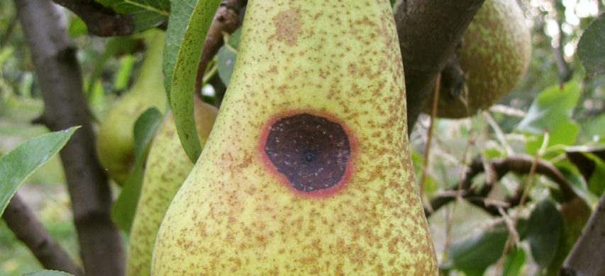

# Brown spot of European Pear

:::: {.columns}
::: {.column width="60%"}

> Brown spot of European Pear
>
> - A company wants to track the spreading of the Brown spot of European pear in Emilia Romagna.
> - Brown spots are caused by a fungus (Stemphylium vesicarium) damaging pear fruits and causing economic loss for producers.
> - Also, the company wants to find out if there are environmental factors related to the spreading of such fungus and the level of damage.

- How would you address this problem?
:::
::: {.column width="40%"}

:::
::::

# Determine the Business Objectives

> Ideally, the goal is to build a dataset such as the following
>
> | *Field*  | *AVG. Temperature* | *Presence of Water Source* | ... | **Level of Damage** |
> |----------|--------------------|----------------------------|-----|---------------------|
> | Field\#1 | 14                 | Close distance             | ... | High                |
> | Field\#2 | 14.5               | Medium distance            | ... | Medium              |
> | Field\#3 | 13.8               | Medium distance            | ... | Low                 |
> | Field\#4 | ...                | ...                        | ... | ...                 |
>
> and to learn relationships between *environmental features* and **Level of Damage** (the target of the analysis).

- What features would you collect?
- How do we translate this problem into a *quantitative metric*?

# Determine the Data Mining Goal

> Ideally, the goal is to build a dataset such as the following
>
> | *Field*  | *AVG. Temperature* | *Presence of Water Source* | ... | **Level of Damage** |
> |----------|--------------------|----------------------------|-----|---------------------|
> | Field\#1 | 14                 | Close distance             | ... | High                |
> | Field\#2 | 14.5               | Medium distance            | ... | Medium              |
> | Field\#3 | 13.8               | Medium distance            | ... | Low                 |
> | Field\#4 | ...                | ...                        | ... | ...                 |
>
> and to learn relationships between *environmental features* and **Level of Damage** (the target of the analysis).
>
> In other words, can we identify features that allows us to predict an accurate level of damage?

Metrics: predict the level of damage with high *accuracy*

- How would you define accuracy?
- How can we collect the data?

# Assess the Situation: how can we collect the data?

> The company prepares a questionnaire on paper with around 100 questions, and one of the employees moves across Emilia-Romagna to ask questions to the farmers and collect their answers.

- In your opinion, what are the pros/cons of this solution?

#

> Once the employee had collected almost 100 questionnaires, the company asked us to apply machine learning techniques to understand which environmental conditions could be related to the spreading of the fungus.

If you were the analyst, what would you do?

# If you were the analyst, what would you do?

> To us, it was impossible to apply machine learning techniques to data on paper.
>
> We prepared a Google Form where answers could be digitalized.
>
> The employee would take ~1 month to return the digitalized questionnaires.
>
> **Issue #1**: some answers were inconsistent with the provided options.
>
> **Issue #2**: what about open questions?
>
> **Issue #3**: what about the trustworthiness of the data? E.g., there are some pesticides/fertilizers whose application is constrained by Italian/European laws. Can we trust the answers to these questions?
>
> **Issue #4**: we have a dataset of 100 features (assuming for simplicity that each question can be simply turned into an attribute), and a dataset of 100 data.

Outcome?

- This project was missing a proper plan (business+data understanding), and turned out to be a failure for the company.
- Even if we apply ML techniques to the data, the results we would get are not statistically relevant.